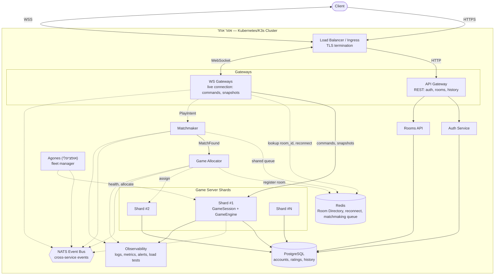

# תכנון שרת KFCHESS לקנה מידה עולמי

## מטרות ודרישות קנה מידה

היעד: 100 מיליון משתמשים רשומים, 10 מיליון שחקנים פעילים בו-זמנית, פעולה
אחת לשחקן בממוצע כל 2 שניות, משחק שאורך 30–90 שניות. זה גוזר בערך:

- **~4.5 מיליון חדרים פעילים** בו-זמנית.
- **~5 מיליון פעולות בשנייה** בעולם כולו (כ-1 לחדר בממוצע).
- **~50,000–150,000 יצירה/סגירה של חדרים בשנייה**.

100 מיליון המשתמשים הרשומים כמעט ואינם נוגעים לנתיב החם — הם קובעים גודל
טבלה ב-PostgreSQL, לא עומס זמן-אמת. 10 מיליון השחקנים הפעילים ו-4.5 מיליון
החדרים הם המספרים שקובעים קיבולת.

**מגבלת רוחב-פס, מחוץ להיקף בכוונה:** ארכיטקטורת השירותים המבוזרת יכולה
להתרחב אופקית (עוד Gateway-ים, עוד Game Server Shards), אבל פרוטוקול שידור
תמונת מצב מלאה בכל טיק (במקום דלתא) מונע בפועל הגעה ל-10 מיליון שחקנים —
זו מגבלת התעבורה עצמה, לא מגבלת מספר התהליכים. השגת היעד המלא דורשת דלתא,
קצב עדכון נמוך יותר, דחיסה, או אופטימיזציית רוחב-פס אחרת — מחוץ להיקף כאן.

---

## ארכיטקטורה נוכחית (תקציר)

היום מדובר בתהליך שרת יחיד (`python -m server.ws_server`) שמחזיק את המנוע
(`GameEngine`, `GameSession`), את השידוך (`Matchmaker`, `GameRoomRegistry`)
ואת החיבורים, מול PostgreSQL (חשבונות/דירוגים) ו-Redis (ניתוב/גילוי בין
תהליכים). **זו פריסה חד-תהליכית לפיתוח ולבדיקות בקנה מידה מוגבל — לא
תוכננה ולא נמדדה (benchmark) מול 10 מיליון שחקנים, ואין כאן שום מספר
קונקרטי של קיבולת נתמכת עד שיתבצעו מדידות עומס אמיתיות.** המחלקות נשארות
נכונות כמושג; התהליך היחיד צריך להתפצל לשכבות שרת שמתוכננות להתרחב
**אופקית** — עותקי Gateway רבים, הרבה Game Server Shards, מספר clusters
ואזורים — וזה ההבדל בין **ארכיטקטורת היעד** (בהמשך) ל-**מימוש נוכחי**
(מה שבאמת קיים בקוד כרגע).

חלק מהצעדים לקראת ארכיטקטורת היעד כבר בוצעו בתוך אותו תהליך יחיד, כדי
לבדוק הנחות לפני פיצול אמיתי לתהליכים נפרדים — ראו טבלת מצב המימוש למטה.

---

## ארכיטקטורת יעד

קו רציף = נתיב בקשה/נתונים בפועל; קו מקווקו = נתיב בקרה/הקצאה (לא תעבורת
משחק בזמן אמת). `EventDispatcher` נשאר מקומי לחדר תמיד — רק אירוע עסקי
חוצה-שירות עובר דרך NATS.

התרשים מציג cluster/אזור אחד. קנה מידה עולמי אמיתי חוזר על אותה תמונה
per-region, עם ניתוב מודע-לאזור ב-DNS/Load Balancer — לא מפורט כאן.

---

## רכיבים עיקריים ואחריות

| רכיב | תפקיד |
|---|---|
| Load Balancer | נקודת כניסה יחידה מהאינטרנט; מסיים TLS; מנתב לעותק Gateway נכון. בפועל תחת Kubernetes זה Ingress/Service מובנה. |
| API Gateway | פעולות שאינן זמן-אמת: אימות (Auth Service), רשימת חדרים/היסטוריה (Rooms API). |
| WS Gateway | מחזיק את החיבור החי מול הלקוח: פקודות משחק, עדכוני מצב, ובקשת שידוך (מגיעה על אותו חיבור). מנתב פקודות ל-Game Server הנכון ובקשות שידוך ל-Matchmaker. |
| Matchmaker | משדך שחקנים לפי דירוג, מול תור שידוך משותף. |
| Game Allocator | בוחר איזה Game Server Shard יארח חדר שזה עתה שודך, ורושם ב-Room Directory — נפרד משידוך עצמו. |
| Game Server Shard | תהליך שמארח הרבה חדרים בבת אחת; `GameSession`/`GameEngine` הם הבעלים היחיד והסמכותי של מצב משחק חי. |
| Room Directory (Redis) | מטא-דאטה של ניתוב/גילוי בין תהליכים בלבד: חדר→shard, משתמש→חדר, קוד הצטרפות→חדר. לעולם לא מצב חי (GameSession/sockets). |
| PostgreSQL | חשבונות, דירוגים, תוצאות/היסטוריית משחקים. |
| NATS | תקשורת עסקית בין-שירותית ובקרה (Matchmaker↔Game Allocator↔Game Server); לא תעבורת משחק חיה. |
| Agones (אופציונלי) | fleet manager ל-Game Server Shards תחת Kubernetes: הקצאה, שחרור, בדיקות חיות מובנות. |
| Observability | לוגים, מדדים, התראות, בדיקות עומס לכל שירות — לא קוסמטי, הדרך לאמת הנחות קיבולת. |
| EventDispatcher | pub/sub מקומי לחדר בלבד, לא חוצה תהליכים. |

---

## זרימות עיקריות

- **התחברות:** לקוח ⟶ Load Balancer (TLS) ⟶ API Gateway ⟶ Auth Service ⟶ PostgreSQL; API Gateway מחזיר ללקוח token קצר-טווח, שמוצג בפתיחת חיבור ה-WebSocket מול WS Gateway במקום לשלוח סיסמה שוב.
- **פעולת משחק חיה:** לקוח ⟶ WS Gateway ⟶ Game Server Shard (`GameSession`/`GameEngine`) ⟶ שידור תמונת מצב/אירועים חזרה.
- **שידוך:** `PlayIntent` (על החיבור החי) ⟶ WS Gateway ⟶ Matchmaker ⟶ (נמצא שידוך) ⟶ Game Allocator בוחר Shard ורושם ב-Room Directory ⟶ שני הצדדים מנותבים לחדר, גם אם התחברו דרך WS Gateway-ים שונים.
- **הצטרפות לחדר פרטי / התחברות מחדש:** WS Gateway קורא `room_id`/`username→room_id` מה-Room Directory ומנתב ישירות לתהליך הנכון — במקום סריקה של כל התהליכים.

---

## למה נבחרו PostgreSQL, Redis, NATS, Docker Compose, Kubernetes

| טכנולוגיה | למה |
|---|---|
| PostgreSQL | SQLite מניח כותב יחיד וכתיבה סינכרונית חוסמת בתוך תהליך יחיד — לא עומד בקצב סיום משחקים בעולם. המעבר ל-PostgreSQL משותף בוצע, עם הפרדת עומס בין חשבונות (קטן) לדירוגים (גבוה); הגישה כרגע עדיין סינכרונית (`psycopg2`) בלי connection pool — driver אסינכרוני/pooling נשארים עבודה פתוחה. |
| Redis | ריבוי תהליכי Game Server שובר מבני זיכרון מקומיים (Matchmaker/GameRoomRegistry) — שחקן בתהליך אחד לא רואה שחקן ממתין בתהליך אחר. Redis מחזיק רק מטא-דאטת ניתוב/גילוי, לעולם לא מצב חי (לא ניתן לסריאליזציה בכלל). |
| NATS | תקשורת בין-שירותית (Matchmaker↔Game Allocator↔Game Server) צריכה מתווך רשת ברגע שאלה תהליכים נפרדים — לא לפני שיש יותר מצרכן אחד לאותו אירוע. |
| Docker Compose | גרסה קטנה של כל הרכיבים יחד על מחשב אחד, לוודא שחלוקת האחריות עובדת בפועל לפני קנה מידה עולמי — עדיף מערכת קטנה שעובדת מאשר לבנות הכול בבת אחת. |
| Kubernetes | מריץ ומאזן עותקים רבים של כל שירות לפי עומס בפועל, עם בדיקות חיות לזיהוי תהליך שנפל; Agones (אופציונלי) מוסיף fleet management ייעודי ל-Game Server Shards. |

---

## החלטות קנה-מידה עיקריות ופשרות

- **תהליך אחד : חדרים רבים**, לא קונטיינר לכל חדר — בקצב של עשרות אלפי חדרים/שנייה, קונטיינר-לכל-חדר הוא עלות scheduler בלתי אפשרית. תקרת חדרים לעותק נקבעת לפי CPU (טיק חד-thread), לא זיכרון — חייבת להימדד, לא להיות מוערכת.
- **`GameSession` לא ניתן לשחזור.** קריסת תהליך = אובדן כל החדרים שהוא אירח; אי אפשר לבנות מחדש מצב משחק חי מבחוץ. הפתרון הוא זיהוי מהיר (liveness/heartbeat) וסגירה נקייה לפי כללי עסק — לא נסיון שחזור.
- **שידור תמונת מצב מלאה בכל טיק נשאר כפי שהוא** (לא דלתא) — מגבלת רוחב-הפס שתוארה למעלה היא זו שמונעת בפועל הגעה ל-10 מיליון שחקנים, לא מספר התהליכים; הפתרון (דלתא/קצב נמוך/דחיסה) נשאר מחוץ להיקף.
- **תיחום ל-cluster/אזור אחד לעת עתה** — קנה מידה עולמי אמיתי דורש רפליקציה per-region, לא מפורט כאן.
- **Matchmaker/Game Allocator כשירותים נפרדים ממתינים לממסר Gateway↔Game-Server** (מפת הדרכים, שלבים 7–8) — אין טעם ב"קוד ללא לוגיקה אמיתית" (למשל `GameAllocator` שתמיד בוחר את ה-shard היחיד הקיים) לפני שיש תהליכים נפרדים אמיתיים לבדוק מולו.

---

## מצב מימוש נוכחי

| רכיב | מצב |
|---|---|
| PostgreSQL במקום SQLite | בוצע — גישה סינכרונית (`psycopg2`), ללא connection pool; driver אסינכרוני/pooling עדיין פתוח |
| Room Directory (Redis: חדר/משתמש/קוד הצטרפות) | בוצע — עדיין תהליך יחיד |
| פיצול API Gateway / WS Gateway | בוצע — פיצול פנים-תהליכי (אותו תהליך), לא עדיין שני שירותים |
| Load Balancer (סיום TLS) | בוצע חלקית — reverse proxy מסיים-TLS מול backend יחיד; ניתוב בין עותקי Gateway עדיין לא רלוונטי (אין עותקים) |
| Matchmaker / Game Allocator כשירותים נפרדים | ממתין לממסר Gateway↔Game-Server (ראו מפת דרכים) |
| קונטיינריזציה, Docker Compose (גרסה מלאה), ממסר Gateway↔Game-Server, Rooms API, NATS, Kubernetes, Agones | לא מומשו עדיין |

---

## מפת דרכים למעבר

| # | שלב | מצב |
|---|---|---|
| 1 | PostgreSQL במקום SQLite, כולל תיקון סדר עדכון דירוג | בוצע |
| 2 | Room Directory על Redis (עדיין תהליך יחיד) | בוצע |
| 3 | הפרדת API Gateway ו-WS Gateway מ-ConnectionLifecycle | בוצע (פנים-תהליכי) |
| 4 | Load Balancer מול ה-Gateway-ים עם סיום TLS | בוצע חלקית (reverse proxy, backend יחיד) |
| 5 | קונטיינריזציה של התהליכים הרלוונטיים (Game Server, Gateways) | ממתין |
| 6 | הרצת כמה שירותים ו-Shards יחד תחת Docker Compose | ממתין |
| 7 | ממסר בין-תהליכי מ-WS Gateway ל-Game Server Shard | ממתין |
| 8 | שידוך משותף ו-Game Allocator כשירותים נפרדים מול Room Directory | ממתין |
| 9 | מתווך רשת (NATS) לתקשורת בין-שירותית, לפי הצורך | ממתין |
| 10 | הרצה תחת Kubernetes (או Agones מעליו) | ממתין |
| 11 | Observability (לוגים, מדדים, התראות, בדיקות עומס) לכל שירות | ממתין |

