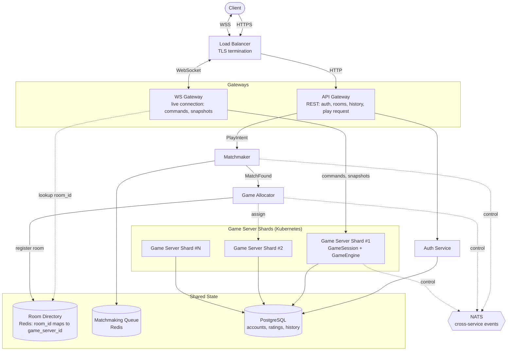

# תכנון שרת KFCHESS לקנה מידה עולמי — ממבנה נוכחי לארכיטקטורה מבוזרת

היום מדובר בתהליך שרת אחד (`python -m server.ws_server`) שמחזיק את המנוע
(`GameEngine`, `GameSession`), את השידוך (`Matchmaker`, `GameRoomRegistry`)
ואת הנתונים (SQLite דרך `UserStore`/`RatingStore`). זה עובד מצוין עד אלפי
משתמשים בו-זמנית, אך לא ל-100 מיליון משתמשים רשומים ו-10 מיליון שחקנים
פעילים ברחבי העולם: המחלקות נשארות נכונות כמושג, אבל התהליך היחיד חייב
להתפצל לשכבות שרת, וחלקים שלא תוכננו לקנה מידה כזה (בעיקר SQLite ומבני
הזיכרון החד-תהליכיים) חייבים להוחלף.

מסמך זה נשען על הקוד הקיים בפועל — מחלקות וקבועים אמיתיים מ-`server/`,
`engine/`, `events/` ו-`protocol/` — ולא על שמות טכנולוגיה כלליים: כל שינוי
מוצדק דרך התנהגות קונקרטית של הקוד היום.

מבנה הרכיבים והמינוח בהמשך המסמך מיושרים גם מול הארכיטקטורה שהוצעה בקורס
(API Gateway / WS Gateway / Matchmaker / Game Allocator / Game Server
Shards / Observability, על Redis, PostgreSQL, Docker Compose ו-Kubernetes)
— אבל כל רכיב עדיין מוסבר דרך מה שהוא מחליף או מפצל בקוד הקיים, לא כהעתקה
של דיאגרמה.

---

## מילון מונחים — בהקשר של KFCHESS עצמו

- **Game Server (Shard)** — תהליך `ws_server.main` כפי שהוא היום: מארח
  `UserStore`, `RatingStore`, `GameRoomRegistry`, `Matchmaker` ולולאת השרת
  המשותפת. כל עותק הוא "shard" שמארח הרבה חדרים בבת אחת.
- **Load Balancer** — נקודת הכניסה היחידה מהאינטרנט: מסיימת TLS ומנתבת כל
  חיבור נכנס לאחד מעותקי ה-API Gateway/WS Gateway.
- **API Gateway** — שכבה חדשה מול פעולות שאינן זמן-אמת: אימות (מול Auth
  Service), רשימת חדרים, היסטוריה, בקשת שידוך.
- **WS Gateway** — שכבה חדשה שתיפרד מ-`ConnectionLifecycle`: מחזיקה את
  החיבור החי מול הלקוח (פקודות משחק, עדכוני מצב) ומנתבת אותו ל-Game Server
  הנכון.
- **Room Directory** — מיפוי גלובלי `room_id -> game_server_id`, המקביל למה
  ש-`GameRoomRegistry` כבר עושה בתוך תהליך אחד.
- **Matchmaker** — שירות עצמאי שמכליל את `Matchmaker` הקיים, על תור שידוך
  משותף שנראה לכל תהליכי המשחק.
- **Game Allocator** — מחליט על אילו Game Server Shard ירוץ חדר שזה עתה
  שודך, ורושם את ההחלטה ב-Room Directory — תפקיד נפרד מהשידוך עצמו.
- **Redis** — מממש את ה-Directory ואת תור השידוך המשותף; לא מטמון כללי.
- **PostgreSQL** — מחליף את SQLite ש-`UserStore`/`RatingStore` משתמשים בו,
  לחשבונות, לדירוגים, ולתוצאות/היסטוריית משחקים.
- **NATS (או Redis Pub/Sub)** — מתווך רשת לתקשורת בין-שירותית (Matchmaker
  ↔ Game Allocator ↔ Game Server) ולבקרה; לא לתעבורת המשחק החיה, שנשארת
  מקומית ב-EventDispatcher.
- **Docker Compose** — מריץ גרסה קטנה של כל הרכיבים יחד על מחשב אחד, לצורך
  פיתוח ובדיקה לפני קנה מידה עולמי.
- **Kubernetes** — מריץ ומאזן עותקים רבים של כל שירות (לא חדר משחק בודד)
  לפי עומס בפועל.
- **Agones (אופציונלי)** — fleet manager ייעודי ל-Game Server Shards תחת
  Kubernetes: הקצאה, שחרור ובדיקות חיות מובנות במקום מימוש עצמי.
- **Observability** — לוגים, מדדים, התראות ובדיקות עומס לכל שירות; לא רכיב
  קוסמטי אלא הדרך היחידה לאמת בפועל את ההנחות המסומנות בהמשך המסמך.
- **EventBus (`EventDispatcher`)** — נשאר **מקומי** לחדר, בדיוק כפי שהוא
  היום; רק אירוע עסקי חוצה-שירות עובר דרך מתווך רשת.

---

## תרשים ארכיטקטורה

התרשים הבא מציג את אותם רכיבים מהמילון, ואיך הם מתחברים: קו רציף הוא נתיב
בקשה/נתונים בפועל (למשל חיבור WebSocket חי, או כתיבה ל-PostgreSQL); קו
מקווקו הוא נתיב בקרה/הקצאה (מי מחליט מה, לא תעבורת משחק בזמן אמת) —
בדיוק ההבחנה שעומדת מאחורי "EventDispatcher נשאר מקומי, רק אירוע עסקי
עובר דרך NATS".

כל `Game Server Shard` הוא תהליך יחיד שמארח הרבה חדרים בבת אחת (ראו פרק
Docker) — התרשים מצייר שלושה כדי להראות שהם עותקים מאוזני-עומס, לא כדי
לרמוז על מספר קבוע.

---

## מספרים — הצדקת סדר הגודל

נתון: 100 מיליון משתמשים רשומים, 10 מיליון שחקנים פעילים בו-זמנית, פעולה
אחת לשחקן בממוצע כל 2 שניות, ומשחק שאורך 30–90 שניות.

בהנחה ש-90% מהשחקנים המחוברים יושבים בפועל בתוך חדר (השאר בלובי, בתור
שידוך או בספירת ניתוק):

- **חדרים פעילים בו-זמנית:** 10M × 0.9 / 2 ≈ **4.5 מיליון**.
- **פעולות בשנייה:** 10M / 2 ≈ **5 מיליון בעולם כולו** (כ-1 לחדר בממוצע) —
  כל אחת עוברת דרך `ClientMessageRouter` אל `GameSession`.
- **קצב יצירה/סיום חדרים:** עם משחק ממוצע של 60 שניות, 4.5M / 60 ≈ **75,000
  חדרים בשנייה** (טווח 50,000–150,000 לפי משך המשחק בפועל) — הקצב שבו
  `GameRoomRegistry`, `Matchmaker` ו-`RatingStore` צריכים לפעול בעולם כולו.
- **תעבורת רשת בעיצוב הנוכחי:** `GameRoomRegistry` משדרת תמונת מצב מלאה
  (32 חתיכות, כ-5.6KB במדידה) בכל טיק (~62.5Hz), לכל חיבור. זה מגיע לכ-
  700KB/s לחדר, ו-**כ-3.15TB/s בעולם כולו** — בלתי אפשרי בקנה המידה הזה.
  מעבר לדלתא (לשדר רק מה שזז) בקצב נמוך יותר היה פותר את זה, אבל **הוחלט
  שלא לכלול את זה בהיקף הפרויקט הזה** — זה משנה את פורמט התקשורת שכל לקוח
  תלוי בו, ומורכב ביחס לתועלת כאן. נשארים עם שידור תמונת מצב מלאה כפי
  שהוא, ומקבלים את מגבלת התעבורה הזו כמגבלה ידועה שלא נפתרת בפרויקט הזה.

100 מיליון המשתמשים הרשומים כמעט ואינם נוגעים לנתיב החם: הם קובעים גודל
טבלה וקצב אימותים ב-PostgreSQL, לא את עומס זמן האמת — 10 מיליון השחקנים
הפעילים ו-4.5 מיליון החדרים הם המספרים שקובעים קיבולת.

---

## PostgreSQL במקום SQLite

`UserStore` ו-`RatingStore` פותחים כל אחד חיבור sqlite נפרד לאותו קובץ
(`kf_chess_users.db`), ואף יוצרים בנפרד את אותה טבלה — עיצוב שמניח כותב
יחיד, לא ריבוי תהליכים. חמור מכך: כל `commit()` הוא כתיבה חוסמת וסינכרונית
שמתבצעת בתוך לולאת ה-`asyncio` היחידה (מתוך `ConnectionLifecycle` בהתחברות
ומתוך `GameSession` בסיום משחק) — בקצב של כ-75,000 סיומי משחק בשנייה, כל
commit חוסם את הטיקים של כל חדר אחר שאותו תהליך מארח.

**הפתרון:** PostgreSQL משותף עם driver אסינכרוני (או thread pool) — לעולם
לא קריאה חוסמת על הלולאה. לשמור על ההפרדה שכבר קיימת בין `UserStore` (עומס
קטן, פעיל בהתחברות) ל-`RatingStore` (עומס גבוה, ~75,000 כתיבות/שנייה) —
האחרון זקוק ל-connection pool ו-read replicas משלו.

**סיכון שהמעבר לרשת מחריף, לא רק מאיץ:** `GameSession` מסמן עדכון דירוג
כ"בוצע" **לפני** קריאת `update_ratings`, לא אחריה. מול sqlite מקומי כשל
כתיבה נדיר; מול רשת בקצב הזה, timeout יקרה בפועל — וכשזה קורה, עדכון
הדירוג אובד **לצמיתות** בלי ניסיון חוזר ובלי שגיאה לשחקנים. יש להפוך את
סדר הפעולות (הדגל עולה רק אחרי הצלחה) ולהוסיף ניסיון חוזר אידמפוטנטי לפי
`room_id`.

**תפקיד שלישי, חדש לגמרי:** feature של "היסטוריה" (כפי שנדרש ב-API Gateway)
מחייב טבלת games/results — ואולי היסטוריית מהלכים — שלא קיימת היום בכלל
בקוד. נקודת הכתיבה הטבעית היא אותו מקום שכבר כותב את עדכון הדירוג —
`GameSession._on_game_over` — כך שתוצאה ודירוג נכתבים יחד, לא בשני נתיבים
נפרדים שיכולים להתבדר זה מזה.

**למה SQLite לא מתאים:** קובץ יחיד ללא כותב מקבילי אמיתי בין תהליכים,
וכתיבה סינכרונית שחוסמת תהליך שלם. ברגע שיש יותר מ-Game Server אחד —
הכרחי בקנה המידה הזה — קובץ משותף הוא בדיוק אותה בעיית "כותב יחיד",
בגרסה גרועה יותר.

---

## Redis: ספריית חדרים גלובלית (Room Directory) ותור שידוך משותף

`Matchmaker` ו-`GameRoomRegistry` מחזיקים היום רשימה ומילונים רגילים
בזיכרון תהליך אחד — נכון ופשוט כל עוד יש Game Server יחיד. ברגע שיש יותר
מתהליך אחד זה נשבר בשתי דרכים: שחקן ששולח `PlayIntent` לתהליך אחד לא רואה
שחקן ממתין בתהליך אחר, ושחקן שמנסה להתחבר מחדש נסרק רק מול הרשימה המקומית
של התהליך שנחת עליו — אם החדר שלו חי במקום אחר, החיפוש נכשל אף שהמשחק
פעיל.

**הפתרון:** Redis (או שקול) מחזיק רק את שני הדברים שבאמת צריכים להיות
גלויים בין תהליכים: מיפוי `room_id -> game_server_id` (Room Directory),
ותור השידוך המשותף (אותה צורת נתונים ש-`Matchmaker` כבר עוקב אחריה, רק
גלויה גלובלית). כל שאר המצב המקומי של חדר — EventDispatcher, ספירת ניתוק,
מנויי שידור — נשאר בזיכרון תהליך, בלי סיבה לשתף אותו.

**שתי בעיות שחייבים לתקן באותה נשימה:**
- מזהי החדרים היום הם 6 תווי הקסה (~16.7 מיליון ערכים), נבדקים רק מול
  המילון המקומי של כל תהליך. בקצב של 75,000–150,000 חדרים בשנייה,
  התנגשויות (פרדוקס יום ההולדת) קורות תוך שניות **גם בתוך תהליך יחיד**.
  `room_id` צריך מרחב גדול משמעותית (128 סיביות+), מוקצה מול ה-Directory
  המשותף ולא מול מילון מקומי.
- ה-Directory עצמו הופך למקור אמת גלובלי יחיד — בדיוק סוג נקודת הכשל
  שהמסמך פוסל אצל SQLite. הוא חייב לרוץ כאשכול משוכפל (Redis Cluster או
  Sentinel), לא כמופע בודד.

---

## Matchmaker ו-Game Allocator: שני תפקידים, לא אחד

הסריקה הליניארית של `Matchmaker` (מתאים ראשון בטווח דירוג) מספיקה לתור
קטן בתהליך אחד, לא כשעשרות אלפי שחקנים מחפשים משחק בו-זמנית בעולם.

**הפתרון:** להוציא את אותה לוגיקה (ללא שינוי האלגוריתם) לשירות Matchmaker
עצמאי שקורא וכותב לתור המשותף, מחולק למספר מופעים לפי פלחי דירוג ואזור
כדי לצמצם התאמות בין-אזוריות. כשאלה לא מספיקים תוך זמן סביר, יש לשדך גם
בין אזורים — אבל אז נדרשת החלטה שאין ל-Matchmaker מידע לקבל: איזה Game
Server Shard יארח את החדר. זו אחריות נפרדת, ה-**Game Allocator**: בוחר
Shard לפי עומס נוכחי ותקרת השהיה סבירה לשני הצדדים (לא סתם "הפחות עמוס",
אחרת צד אחד תמיד סובל מחיסרון תגובה), ורושם את הבחירה ב-Room Directory.

רק לאחר מכן שני המשתתפים (שאולי מחוברים לשני WS Gateway-ים שונים לגמרי)
מקבלים הודעה להתחבר — אותה החלטה ש-`ClientMessageRouter` מקבל היום כמובנת
מאליה ("יש רק תהליך אחד"), רק מפורשת ומחולקת בין שני שירותים.

---

## Load Balancer: הצפנה בקצה, וניתוב לעותק ה-Gateway הנכון

**המצב הנוכחי:** `ws_server.main` מריץ `websockets.serve` על `ws://` רגיל —
בלי TLS בכלל. המשמעות מעבר לביצועים: `Login` (`protocol/lobby_messages.
Login`) נושא היום שם משתמש **וסיסמה בטקסט גלוי** בגוף ה-JSON, על חיבור לא
מוצפן. זו לא רק בעיית קנה-מידה — זו בעיית אבטחה שקיימת כבר היום.

**הפתרון:** Load Balancer אחד (מאחורי DNS, לא חכם ולא שומר מצב משחק) הוא
נקודת הכניסה היחידה מהאינטרנט, ומבצע שני תפקידים שאין להם שום קשר לזמן-אמת
של המשחק עצמו:

1. **סיום TLS** — מצפין את כל התעבורה בין הלקוח ל-Load Balancer (HTTPS
   מול API Gateway, WSS מול WS Gateway). התעבורה הפנימית בין ה-Load
   Balancer לעותקי ה-Gateway יכולה לרוץ ברשת פנימית סגורה; מה שחשוב הוא
   שאף בית שהלקוח שולח — בעיקר סיסמת ה-`Login` — לא יוצא גלוי לרשת
   הציבורית.
2. **ניתוב בין עותקי Gateway** — בדיוק כמו Game Server Shards, גם API
   Gateway ו-WS Gateway ירוצו בכמה עותקים תחת Kubernetes; ה-Load Balancer
   מפזר ביניהם חיבורים נכנסים. חיבור WebSocket הוא session ארוך-חיים, לא
   בקשת HTTP בודדת — ברגע שחיבור "נדבק" לעותק WS Gateway מסוים, הוא חייב
   להישאר שם לכל אורך חייו (ניתוב ברמת החיבור, לא ניתוב-מחדש לכל הודעה),
   אחרת החיבור נשבר.

חשוב להבחין בין שני מיפויים שונים, בשתי שכבות שונות: ה-**Load Balancer**
ממפה **לקוח לעותק Gateway**; ה-**Room Directory** ממפה **חדר ל-Game
Server Shard**. הראשון קורה פעם אחת בפתיחת החיבור; השני קורה בכל שיוך
לחדר, ויכול להצביע על תהליך אחר לגמרי מזה שהלקוח מחובר אליו כרגע.

---

## API Gateway ו-WS Gateway: שתי דלתות כניסה, לא אחת

היום תהליך אחד עושה הכול: מקבל חיבור, מאמת מול `UserStore` מקומי (כהודעת
`Login` ראשונה על אותו סוקט), משדך, ומשבץ לחדר — כולו בתוך התהליך שמחזיק
גם את `GameSession` בזיכרון.

**הפתרון:** לפצל לשתי שכבות. **API Gateway** (REST/HTTP) מטפל במה שאינו
זמן-אמת: אימות מול Auth Service (PostgreSQL), רשימת חדרים, היסטוריה,
ובקשת שידוך — במקום `ConnectionLifecycle._authenticate` שמריץ היום את
ההתחברות כהודעה ראשונה על אותו חיבור שממשיך לשאת גם את המשחק. **WS
Gateway** מחזיק את החיבור החי, לאחר האימות, ומנתב אותו ל-Game Server
הנכון. שני דברים שהפיצול הזה חייב להתמודד איתם:

- **עלות אימות:** `UserStore` מבצע 200,000 איטרציות PBKDF2 סינכרוניות לכל
  התחברות — עלות CPU ממשית שתכנון קיבולת ה-API Gateway חייב לכלול, לא רק
  זמן תקשורת מול PostgreSQL.
- **שחקן שממתין לשידוך:** בקשת השידוך עצמה יכולה לצאת מה-API Gateway,
  אבל התוצאה (שידוך נמצא, שיבוץ לחדר) חייבת להגיע ללקוח על חיבור חי —
  כלומר ה-WS Gateway כבר חייב להיות פתוח ומחזיק את השחקן (`PlayIntent`
  יכול להשאירו ב-`SEARCHING` עד 60 שניות) עד שמתקבל שידוך. הוא אינו יכול
  להיות חסר-מצב לחלוטין כל עוד יש תור המתנה.

**איך שחקנים על שרתים שונים מגיעים לאותו חדר?** `GameSession` חי בזיכרון
של Game Server אחד בלבד, כך שכל שיוך לחדר — שידוך חדש (דרך Game Allocator)
או הצטרפות לחדר פרטי לפי `room_id` — עובר קודם דרך ה-Directory: ה-WS
Gateway קורא ממנו את ה-game_server_id הנכון ומנתב את החיבור לשם, גם אם
שני השחקנים מגיעים משני WS Gateway-ים שונים לגמרי.

---

## Docker: תהליך Game Server אחד, לא קונטיינר לכל משחק

`GameRoomRegistry` כבר מארח היום מספר בלתי מוגבל של חדרים בתוך תהליך אחד
עם לולאת טיק משותפת — ההוכחה שהיחידה הטבעית היא "תהליך אחד : חדרים רבים".
קונטיינר לכל חדר, בקצב של כ-75,000 יצירות/סגירות בשנייה, פירושו scheduler
שמתמודד עם עשרות אלפי מחזורי-חיים של קונטיינר בשנייה — עלות קבועה (image,
network namespace, health checks) גדולה בסדרי גודל מגודל המשאב עצמו.

**הפתרון:** לארוז את תהליך Game Server עצמו כקונטיינר, כשכל עותק ממשיך
לארח הרבה חדרים בו-זמנית. מספר העותקים (לא מספר החדרים) מתאזן לפי עומס —
אבל התקרה לעותק נקבעת לפי **CPU**, לא זיכרון: הלולאה היא `asyncio` על
thread יחיד, וטיק כל חדר מתבצע ברצף על ליבה אחת. טביעת הרגל הזעירה
בזיכרון של `GameSession` לא אומרת דבר על כמה חדרים ליבה אחת מסוגלת לתקתק
ב-62.5Hz — זה מספר שחייב להימדד, וכנראה מחייב כמה worker-ים לכל pod כדי
לנצל את כל הליבות.

**לפני קנה מידה עולמי — גרסה קטנה שעובדת:** `docker-compose.yml` שמרים
עותק אחד (או שניים) מכל שירות — API Gateway, WS Gateway, Matchmaker, Game
Allocator, כמה Game Server Shards, Redis, PostgreSQL — הוא הדרך לוודא
שחלוקת האחריות בין הרכיבים עובדת בפועל, לפני שעוברים ל-Kubernetes ולעשרות
עותקים. עדיף מערכת קטנה שעובדת מאשר ניסיון לבנות את כל התמונה בבת אחת.

---

## Kubernetes: מפעיל תהליכי Game Server, לא משחזר GameSession

`GameSession` מחזיק את כל מצב המשחק החי בזיכרון תהליך בלבד — שום דבר לא
נשמר החוצה. **המסקנה המרכזית: Kubernetes יכול להפעיל מחדש קונטיינר שקרס,
אבל לא לשחזר את ה-`GameSession` שהיה בזיכרונו.** תהליך חדש מתחיל עם
`GameRoomRegistry` ריק; שחקן שמנסה להתחבר מחדש לחדר שהיה שם לא ימצא כלום.

הטיפול הנכון הוא זיהוי מהיר (liveness/heartbeat) ועדכון ה-Directory כך
שחדרים תחת תהליך מת ייחשבו כננטשים ויסגרו לפי כללי עסק ברורים (למשל ללא
שינוי דירוג) — לא להשאיר שחקנים מנסים להתחבר מחדש לתהליך שכבר לא קיים.
Agones (fleet manager ייעודי ל-game servers תחת Kubernetes) יודע לעשות
את זה מובנה — הקצאה, שחרור ובדיקות חיות — ושווה לשקול אותו במקום לממש
liveness ו-allocation עצמאיים מאפס.

**עיקרון חוזר: `GameSession` נשאר הבעלים היחיד והסמכותי של משחק חי.** אף
שירות חיצוני לא מנסה לבנות מחדש את מצבו; המחיר הוא שאובדן התהליך שווה
לאובדן המשחק, ואת זה אי אפשר לפתור בתשתית — רק לזהות ולכשל בצורה נקייה.

**בעיה נפרדת שפוגעת באותו חישוב קיבולת, גם בלי קריסה:** `GameRoomRegistry`
סוגר חדר רק כשחיבור נסגר בפועל, לא כשמשחק מסתיים. אם לקוח לא מנתק את
השקע לאחר `GameOverEvent`, החדר נשאר תפוס בזיכרון ללא הגבלת זמן — סותר את
הנחת "חדרים מתפנים בקצב סיום המשחקים" שחישוב הקיבולת בפרק הקודם נשען
עליה. יש להוסיף סגירת חדר יזומה בתום המשחק, עם חלון חסד קצר, ולא להסתמך
רק על ניתוק שקע.

---

## התחברות מחדש בקנה מידה — לחפש נכון, לא בכל מקום

מנגנון ספירת הניתוק (`DisconnectCountdown`, מתקדם דרך `tick(dt_ms)` בזמן
מדומה עד 20 שניות ואז `resign`) נכון וזול ולא צריך להשתנות. מה שכן צריך
להשתנות: `try_reconnect` היום סורק את **כל** החדרים של התהליך שהחיבור
החדש נחת עליו. על תהליך אחד זו סריקה זולה; כשיש 4.5 מיליון חדרים מפוזרים
בין מאות תהליכים, היא לא רק יקרה אלא שגויה — היא פשוט לא תמצא חדר שחי
במקום אחר.

**הפתרון:** ה-WS Gateway קורא את `room_id` (או מיפוי `username -> room_id`)
מה-Directory ומנתב ישירות לתהליך הנכון — הופך חיפוש "בכל העולם" לחיפוש
מדויק בתהליך אחד.

---

## טיפול בכשלים — בידוד חדר בודד מול קריסת תהליך שלם

`GameRoomRegistry` כבר עוטפת כל טיק חדר ב-try/except ורושמת ללוג חדר
שנכשל בלי להפיל חדרים אחרים או את לולאת השרת — נכון בכל קנה מידה, ללא
שינוי. מה שצריך להוסיף הוא הבחנה מפורשת מול כשל תהליך שלם: קריסת Game
Server לוקחת איתה בבת אחת את כל החדרים שהוא אירח, ואי אפשר לשחזר אותם
(ראו פרק Kubernetes) — לכן צריך זיהוי מהיר (liveness) ועדכון Directory
כדי שחדרים תחת תהליך מת ייסגרו לפי כללי עסק ברורים, במקום להשאיר שחקנים
מנסים להתחבר לשום מקום.

מנגנוני הבטיחות הקיימים — תפוגת שידוך (`Matchmaker`) וספירת הניתוק — כבר
נותנים לכל צד תרחיש כשל מוגדר וסופי, בלי תלות בזמינות תהליך מסוים.

---

## Observability — תנאי להפעלה, לא תוספת קוסמטית

בקנה המידה הזה (כ-75,000 חדרים נפתחים/נסגרים בשנייה, 5 מיליון פעולות
בשנייה) אי אפשר להפעיל את המערכת בלי לוגים, מדדים והתראות לכל שירות:
מספר חדרים פעילים לעותק Game Server, פיגור טיק, עומס CPU, וקצב כשלים מול
Redis/PostgreSQL. חשוב לא פחות: **בדיקות עומס** הן הדרך היחידה לאמת בפועל
את המספרים שסומנו למעלה כהנחות ולא כמדידה — בעיקר תקרת החדרים לעותק לפי
CPU (פרק Docker). בלי מדידה בפועל, זה ניחוש מושכל בלבד.

---

## סיכום — מה נשאר, מה מתפצל, מה מוחלף

**נשאר כמושג:** `GameEngine`, `EventDispatcher` המקומי לחדר, `GameSession`
עם מנגנון ההתחברות מחדש והספירה לאחור, `NetworkPublisher`, אלגוריתם
השידוך, ובידוד הטיקים של `GameRoomRegistry`.

**מתפצל לשירותים נפרדים:** אחריות ההתחברות עוברת ל-API Gateway/WS Gateway;
`Matchmaker` הופך לשירות עצמאי מול תור משותף, וההחלטה "איזה Game Server
Shard" יוצאת ממנו לשירות נפרד — Game Allocator; תהליך שרת יחיד הופך למספר
Game Server Shards שחולקים Room Directory.

**מוחלף:** SQLite ב-PostgreSQL (חשבונות, דירוגים, ותוצאות/היסטוריית
משחקים); תהליך יחיד בעותקי קונטיינר Game Server תחת Kubernetes, עם
Docker Compose כגרסת פיתוח מצומצמת; מבני הזיכרון המקומיים של
`GameRoomRegistry` (כולל ייצור `room_id`) ברישום גלובלי מבוסס Redis;
תקשורת עסקית בין-שירותית על NATS.

**נשאר בכוונה מחוץ להיקף:** שידור תמונת מצב מלאה בכל טיק (`GameRoomRegistry.
_broadcast_snapshot`) **לא** מוחלף בדלתא — הוחלט להשאיר את זה כפי שהוא
בפרויקט הזה, למרות מגבלת התעבורה שתוארה בפרק המספרים.

**נוסף מרכיב חדש, שלא קיים היום בכלל:** Load Balancer עם סיום TLS מול
הלקוח (היום `ws://` בלי הצפנה, כולל סיסמת `Login` בטקסט גלוי) וניתוב בין
עותקי ה-Gateway — מיפוי לקוח-לעותק, נפרד ממיפוי חדר-לשרת של ה-Directory.

---

## מבנה תיקיות מוצע לפיצול לשירותים (שלבים 3, 5, 7 למטה)

מבנה תיקיות כמו `server/api_gateway`, `server/ws_gateway`, `server/matchmaker`,
`server/game_allocator`, `server/game_server` עולה בקנה אחד עם המילון והתרשים
שלמעלה — כל תיקייה היא בדיוק אחד מחמשת הרכיבים שכבר מוגדרים כאן, בלי המצאת
רכיב נוסף:

- **`api_gateway/`** (`main.py`, `routes.py`, `auth.py`) — מחליף את חלקי
  האימות של `ConnectionLifecycle._authenticate`/`await_login` היום.
- **`ws_gateway/`** (`main.py`, `connection_manager.py`) — מחליף את שאר
  `ConnectionLifecycle` (מחזיק חיבור, מנתב לפי `room_id`/Directory).
- **`matchmaker/`** (`main.py`, `queue.py`) — מכליל את `server/matchmaker.py`
  הקיים מול תור משותף במקום רשימה בזיכרון תהליך אחד.
- **`game_allocator/`** (`main.py`, `allocator.py`) — רכיב חדש (ראו פרק
  Matchmaker ו-Game Allocator למעלה) שמפריד "בחירת Shard" מ"שידוך שחקנים".
- **`game_server/`** (`main.py`, `session.py`, `rooms.py`) — מכליל
  `server/session.py` ו-`server/rooms.py` הקיימים כמעט ללא שינוי; זה נשאר
  "תהליך אחד : חדרים רבים" בדיוק כפי שפרק Docker קובע.

**שתי נקודות פתוחות שהחלוקה הזו לא פותרת מאליה, וכדאי להכריע בהן במפורש
כשמבצעים את הפיצול בפועל, לא תוך כדי:**

1. **ל-`UserStore`/`RatingStore` (PostgreSQL) אין תיקייה.** `api_gateway`
   צריך אותם לאימות, ו-`game_server` צריך אותם לעדכון דירוג בסיום משחק —
   שני צרכנים משני שירותים שונים. אם הם לא נשארים ספריית-קוד משותפת
   שנקראת ישירות (מה שדורש ששני השירותים ידברו מול אותו PostgreSQL), צריך
   להחליט אם הם הופכים לשירות "חשבונות" עצמאי משלהם.
2. **ל-`ClientMessageRouter` אין תיקייה.** הניתוב-לפי-סוג-הודעה שהוא עושה
   היום כקריאת פונקציה ישירה (`self._matchmaker.enqueue_or_match(...)`,
   `self._game_room_registry.game_session_for(...)`) חייב להפוך לקריאת רשת
   ברגע שהיעד הוא שירות נפרד — הבית הטבעי הוא בתוך `ws_gateway/`, אבל זו
   נקודת עבודה אמיתית, לא רק הזזת קובץ.

`protocol/`, `engine/`, `events/`, `model/`, `rules/` נשארים חבילות משותפות
מחוץ ל-`server/`, בדיוק כפי שהם היום — אף שירות לא מעתיק אותם לעצמו.

**אזהרה חשובה: זו חלוקת תיקיות, לא עדיין חלוקת שירותים.** כל עוד הקריאות
בין התיקיות האלה הן קריאת-פונקציה ישירה בתוך אותו תהליך Python (כמו היום),
אין כאן עדיין שום דבר שניתן לקנה-מידה בנפרד — התועלת האמיתית מגיעה רק
כששלבים 2/5/10 למטה (Redis Directory, הפרדת Game Allocator, NATS) הופכים
את הקריאות האלה לקריאות רשת אמיתיות בין תהליכים נפרדים.

---

## סדר מומלץ למעבר

1. **PostgreSQL במקום SQLite**, כולל תיקון סדר הפעולות בעדכון דירוג (הדגל
   עולה רק אחרי הצלחה) וטבלת games/history חדשה — מסיר את סיכון החסימה
   ואת סיכון האובדן השקט לפני נגיעה בעיצוב המבוזר.
2. **Room Directory ותור שידוך משותף על Redis משוכפל**, כולל מזהה חדר
   במרחב גדול מספיק שמוקצה מול ה-Directory — עדיין עם תהליך יחיד, כדי
   לבדוק את ההנחות במפורש.
3. **הפרדת API Gateway ו-WS Gateway** מ-`ConnectionLifecycle`, כולל אחזקת
   חיבורים שממתינים לשידוך לפני שיש חדר.
4. **הוספת Load Balancer מול ה-Gateway-ים, עם סיום TLS** — במקום ה-`ws://`
   הלא-מוצפן של היום — וניתוב בין עותקי ה-Gateway. מוקדם בכוונה: סיסמת
   `Login` עוברת היום בטקסט גלוי, וזו בעיה גם בגרסת הפיתוח הקטנה.
5. **הפרדת Matchmaker מ-Game Allocator** — שידוך שחקנים לעומת בחירת Game
   Server Shard — כשני שירותים נפרדים מול Room Directory משותף.
6. **גרסה קטנה עובדת עם Docker Compose** לכל הרכיבים יחד, לפני קנה מידה
   עולמי — לוודא שחלוקת האחריות עובדת בפועל.
7. **הכנסת Game Server לקונטיינר Docker אחד**, עם תקרת חדרים לעותק
   שנקבעת ב-benchmark ולא בהערכה, וסגירת חדר יזומה בתום המשחק.
8. **הרצה תחת Kubernetes** (או Agones מעליו) עם קנה מידה עצמאי לכל שכבה
   ובדיקת חיות לזיהוי תהליך שנפל.
9. **פיצול Matchmaker לשירות מבוזר** לפי דירוג ואזור — רק אחרי שנצפה
   בפועל צוואר-בקבוק.
10. **מתווך רשת (NATS או Redis Pub/Sub) לאירועים עסקיים בין-שירותיים** רק
    כשיש יותר מצרכן אחד לאותו אירוע.
11. **Observability** (לוגים, מדדים, התראות, בדיקות עומס) לכל שירות —
    ובדיקות העומס הן גם מה שמאמת את הנחת תקרת החדרים-לעותק בפרק Docker.

**מחוץ להיקף בכוונה:** מעבר משידור תמונת מצב מלאה לדלתא (ראו פרק
המספרים) — לא מיושם בפרויקט הזה.

> **עיקרון מרכזי:** `EventDispatcher` נשאר מקומי לחדר בדיוק כפי שהוא היום;
> רק מה שחוצה גבול שירות עובר דרך מתווך רשת.

