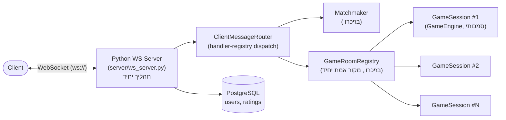
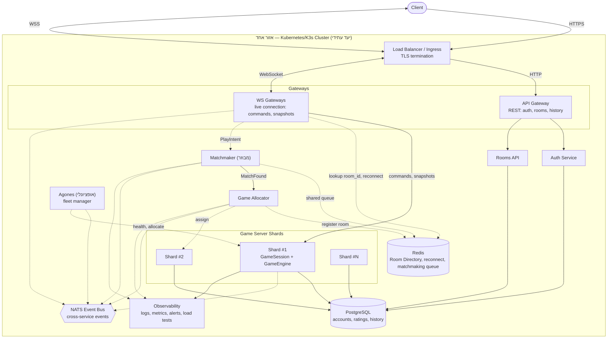

# תכנון שרת KFCHESS

## מבנה המסמך

המסמך מחולק לשני חלקים נפרדים במפורש, כדי שלא יהיה בלבול בין מה שרץ בפועל
למה שמתוכנן:

- **חלק א׳ — הארכיטקטורה המיושמת בפועל.** מתאר בדיוק את מה שקיים היום
  בקוד של הענף הזה, ניתן להרצה מקומית (`python -m server.ws_server`)
  ומכוסה בסוויטת הטסטים.
- **חלק ב׳ — ארכיטקטורת היעד לקנה מידה עולמי.** דרישת הקורס למערכת
  מבוזרת שתומכת במיליוני משתמשים. **שום רכיב בחלק ב׳ אינו קיים כקוד
  בענף הזה** — זהו תכנון אדריכלי לשלב הבא בלבד, לא תיאור של המערכת
  הפועלת כרגע. כל שורה בטבלת הרכיבים של חלק ב׳ מסומנת “יעד עתידי — לא
  ממומש” כדי שההבחנה תישאר ברורה גם בבדיקת קוד (code review).

---

# חלק א׳ — הארכיטקטורה המיושמת בפועל

## סקירה

תהליך Python יחיד, `python -m server.ws_server`, מחזיק את כל המערכת:

- **חיבור WebSocket ישיר** מול כל לקוח — אין Gateway נפרד, אין Load
  Balancer, אין TLS-terminating proxy.
- **`Matchmaker` בזיכרון** — תור שידוך לפי דירוג, מבנה נתונים רגיל
  בתוך התהליך, לא Redis ולא תור משותף.
- **`GameRoomRegistry` בזיכרון כמקור האמת היחיד לחדרים פעילים** —
  `dict` פשוט של `room_id -> GameSession`, בלי Redis, בלי Room
  Directory, בלי שום מטא-דאטה חיצונית לתהליך.
- **`GameSession`/`GameEngine` per room** — מצב המשחק הסמכותי, כולו
  בזיכרון של אותו תהליך יחיד.
- **PostgreSQL** (`UserStore`, `RatingStore`) — הרכיב היחיד שאינו
  בזיכרון: חשבונות משתמשים ודירוגים, בתהליך נפרד (container).

תמיכה בכמה חדרים בו-זמנית **כן קיימת** במימוש הנוכחי — `GameRoomRegistry`
מנהל כל חדר כ-`GameSession` עצמאי בתוך אותו תהליך, וה-tick loop המשותף
(`server/ws_server.py`) מקדם את כולם על אותו thread. מה שאין הוא ריבוי
**תהליכים**: כל החדרים חיים בתוך תהליך Python אחד.

## דיאגרמה

## רכיבים

| רכיב | תפקיד | היכן חי |
|---|---|---|
| `server/ws_server.py` | תהליך יחיד: מקבל כל חיבורי ה-WebSocket, מריץ את לולאת ה-tick המשותפת לכל החדרים | תהליך אחד |
| `ClientMessageRouter` | דיספאצ׳ר `type(message) -> handler` (registry, לא if/isinstance) עבור `Login`/`MoveIntent`/`JumpIntent`/`PlayIntent`/`CreateRoomIntent`/`JoinRoomIntent` | בזיכרון, אותו תהליך |
| `Matchmaker` | תור שידוך לפי דירוג | בזיכרון, אותו תהליך |
| `GameRoomRegistry` | `dict` בין `room_id` ל-`GameSession`: יצירה, הצטרפות, ניתוק, reconnect, tick, סגירת חדר | בזיכרון, אותו תהליך — מקור האמת היחיד לחדרים פעילים |
| `GameSession` / `GameEngine` | מצב משחק סמכותי, per room | בזיכרון, אותו תהליך |
| PostgreSQL (`UserStore`, `RatingStore`) | חשבונות ודירוגים | תהליך/container נפרד |

## פרוטוקול (מה שקיים היום)

הודעות טיפוסיות (`dataclass`), רשומות עם type-tag ב-`protocol/registry.py`:
`Login`, `LoggedIn`, `PlayIntent`, `CreateRoomIntent`, `JoinRoomIntent`,
`RoomRejected`, `MatchNotFound`, `RoleAssigned`, `MoveIntent`, `JumpIntent`,
`GameSnapshot`, ואירועי משחק (`CaptureEvent`, `GameOverEvent` וכו׳).
`ClientMessageRouter` שולח כל הודעה נכנסת ל-handler הפרטי שלה דרך רישום
`type(message) -> method` שנבנה פעם אחת ב-`__init__` — אין שרשרת
`isinstance` ואין handler משותף בין `MoveIntent` ל-`JumpIntent`.

## מגבלות ידועות של הפריסה הנוכחית

- **תהליך יחיד = single point of failure.** קריסת התהליך מאבדת את כל
  החדרים הפעילים בבת אחת; אין דרך לשחזר `GameSession` מבחוץ.
- **קיבולת מוגבלת ל-CPU של תהליך יחיד** — אין מנגנון להוסיף עוד עותקים
  ואין חלוקת עומס בין תהליכים.
- **Reconnect עובד רק כי הכול עדיין באותו תהליך** — `GameRoomRegistry`
  מוצא מחדש את המשתמש בתוך אותו `dict` מקומי; אין Directory משותף בין
  תהליכים לבדוק מולו.
- **אין ניתוב מבוזר** — אין Redis, אין NATS, אין Room Directory; כל
  המידע חי ומת עם התהליך היחיד.

זהו בדיוק הפער שחלק ב׳ (ארכיטקטורת היעד) בא לסגור — ולא משהו שהמימוש
הנוכחי מתיימר לפתור.

---

# חלק ב׳ — ארכיטקטורת היעד לקנה מידה עולמי (דרישת הקורס — טרם מומש)

> **הבהרה חוזרת:** כל מה שמופיע מכאן ועד סוף המסמך הוא תכנון אדריכלי
> בלבד. אף אחד מהרכיבים הבאים — API Gateway, WS Gateway כתהליך נפרד,
> Matchmaker/Game Allocator מבוזרים, Game Server Shards, Redis, NATS,
> Docker Compose, Kubernetes/K3s — **אינו קיים כקוד בענף הזה**. חלק א׳
> למעלה הוא התיאור המדויק היחיד של מה שרץ בפועל.

## מטרות ודרישות קנה מידה

היעד: 100 מיליון משתמשים רשומים, 10 מיליון שחקנים פעילים בו-זמנית, פעולה
אחת לשחקן בממוצע כל 2 שניות, משחק שאורך 30–90 שניות. זה גוזר בערך:

- **~4.5 מיליון חדרים פעילים** בו-זמנית.
- **~5 מיליון פעולות בשנייה** בעולם כולו (כ-1 לחדר בממוצע).
- **~50,000–150,000 יצירה/סגירה של חדרים בשנייה**.

100 מיליון המשתמשים הרשומים כמעט ואינם נוגעים לנתיב החם — הם קובעים גודל
טבלה ב-PostgreSQL, לא עומס זמן-אמת. 10 מיליון השחקנים הפעילים ו-4.5 מיליון
החדרים הם המספרים שקובעים קיבולת.

**מגבלת רוחב-פס, מחוץ להיקף בכוונה:** ארכיטקטורת השירותים המבוזרת יכולה
להתרחב אופקית (עוד Gateway-ים, עוד Game Server Shards), אבל פרוטוקול שידור
תמונת מצב מלאה בכל טיק (במקום דלתא) מונע בפועל הגעה ל-10 מיליון שחקנים —
זו מגבלת התעבורה עצמה, לא מגבלת מספר התהליכים. השגת היעד המלא דורשת דלתא,
קצב עדכון נמוך יותר, דחיסה, או אופטימיזציית רוחב-פס אחרת — מחוץ להיקף כאן.

## מה משתנה בין נקודת ההתחלה (חלק א׳) ליעד

המחלקות עצמן (`GameEngine`, `GameSession`, `Matchmaker`,
`GameRoomRegistry`) נשארות נכונות כמושג גם בארכיטקטורת היעד. מה שצריך
להשתנות הוא הפריסה — התהליך היחיד מתפצל לשכבות שרת שמתוכננות להתרחב
**אופקית**: עותקי Gateway רבים, הרבה Game Server Shards, מספר clusters
ואזורים.

## ארכיטקטורת יעד (דיאגרמה)

קו רציף = נתיב בקשה/נתונים בפועל; קו מקווקו = נתיב בקרה/הקצאה (לא תעבורת
משחק בזמן אמת). `EventDispatcher` נשאר מקומי לחדר תמיד — רק אירוע עסקי
חוצה-שירות עובר דרך NATS.

התרשים מציג cluster/אזור אחד. קנה מידה עולמי אמיתי חוזר על אותה תמונה
per-region, עם ניתוב מודע-לאזור ב-DNS/Load Balancer — לא מפורט כאן.

## רכיבים עיקריים ואחריות (יעד עתידי — אף שורה כאן אינה ממומשת)

| רכיב | תפקיד | סטטוס |
|---|---|---|
| Load Balancer | נקודת כניסה יחידה מהאינטרנט; מסיים TLS; מנתב לעותק Gateway נכון. בפועל תחת Kubernetes זה Ingress/Service מובנה. | יעד עתידי — לא ממומש |
| API Gateway | פעולות שאינן זמן-אמת: אימות (Auth Service), רשימת חדרים/היסטוריה (Rooms API). | יעד עתידי — לא ממומש |
| WS Gateway (כתהליך נפרד) | מחזיק את החיבור החי מול הלקוח: פקודות משחק, עדכוני מצב, ובקשת שידוך. מנתב פקודות ל-Game Server הנכון ובקשות שידוך ל-Matchmaker. | יעד עתידי — לא ממומש |
| Matchmaker (מבוזר, כשירות נפרד) | משדך שחקנים לפי דירוג, מול תור שידוך משותף ב-Redis. | יעד עתידי — לא ממומש (היום: בזיכרון, אותו תהליך) |
| Game Allocator | בוחר איזה Game Server Shard יארח חדר שזה עתה שודך, ורושם ב-Room Directory. | יעד עתידי — לא ממומש |
| Game Server Shard | תהליך שמארח הרבה חדרים בבת אחת; `GameSession`/`GameEngine` הבעלים היחיד והסמכותי של מצב משחק חי. | יעד עתידי — לא ממומש (היום: כל החדרים בתהליך אחד משותף) |
| Room Directory (Redis) | מטא-דאטה של ניתוב/גילוי בין תהליכים: חדר→shard, משתמש→חדר, קוד הצטרפות→חדר. | יעד עתידי — לא ממומש |
| PostgreSQL | חשבונות, דירוגים, תוצאות/היסטוריית משחקים. | **ממומש כבר היום** (ראו חלק א׳) |
| NATS | תקשורת עסקית בין-שירותית ובקרה (Matchmaker↔Game Allocator↔Game Server). | יעד עתידי — לא ממומש |
| Agones (אופציונלי) | fleet manager ל-Game Server Shards תחת Kubernetes. | יעד עתידי — לא ממומש |
| Observability | לוגים, מדדים, התראות, בדיקות עומס לכל שירות. | יעד עתידי — לא ממומש |
| EventDispatcher | pub/sub מקומי לחדר בלבד, לא חוצה תהליכים. | **ממומש כבר היום** (בתוך `GameSession`, מקומי לחדר) |

## זרימות עיקריות (יעד)

- **התחברות:** לקוח ⟶ Load Balancer (TLS) ⟶ API Gateway ⟶ Auth Service ⟶ PostgreSQL; API Gateway מחזיר ללקוח token קצר-טווח, שמוצג בפתיחת חיבור ה-WebSocket מול WS Gateway במקום לשלוח סיסמה שוב.
- **פעולת משחק חיה:** לקוח ⟶ WS Gateway ⟶ Game Server Shard (`GameSession`/`GameEngine`) ⟶ שידור תמונת מצב/אירועים חזרה.
- **שידוך:** `PlayIntent` (על החיבור החי) ⟶ WS Gateway ⟶ Matchmaker ⟶ (נמצא שידוך) ⟶ Game Allocator בוחר Shard ורושם ב-Room Directory ⟶ שני הצדדים מנותבים לחדר, גם אם התחברו דרך WS Gateway-ים שונים.
- **הצטרפות לחדר פרטי / התחברות מחדש:** WS Gateway קורא `room_id`/`username→room_id` מה-Room Directory ומנתב ישירות לתהליך הנכון — במקום סריקה של כל התהליכים.

## למה נבחרו PostgreSQL, Redis, NATS, Docker Compose, Kubernetes (יעד)

| טכנולוגיה | למה | סטטוס |
|---|---|---|
| PostgreSQL | SQLite מניח כותב יחיד וכתיבה סינכרונית חוסמת בתוך תהליך יחיד — לא עומד בקצב סיום משחקים בעולם. PostgreSQL משותף מפריד עומס בין חשבונות (קטן) לדירוגים (גבוה); בקנה מידה גבוה נדרשים driver אסינכרוני ו-connection pooling, לא גישה סינכרונית לכל בקשה. | **ממומש כבר היום** (סינכרוני, ללא pooling — שיפור עתידי) |
| Redis | ריבוי תהליכי Game Server שובר מבני זיכרון מקומיים (Matchmaker/GameRoomRegistry) — שחקן בתהליך אחד לא רואה שחקן ממתין בתהליך אחר. Redis מחזיק רק מטא-דאטת ניתוב/גילוי, לעולם לא מצב חי. | יעד עתידי — לא ממומש |
| NATS | תקשורת בין-שירותית (Matchmaker↔Game Allocator↔Game Server) צריכה מתווך רשת ברגע שאלה תהליכים נפרדים — לא לפני שיש יותר מצרכן אחד לאותו אירוע. | יעד עתידי — לא ממומש |
| Docker Compose | גרסה קטנה של כל הרכיבים יחד על מחשב אחד, לוודא שחלוקת האחריות עובדת בפועל לפני קנה מידה עולמי. | יעד עתידי — לא ממומש (היום: PostgreSQL בלבד ב-Docker Compose, לצורך פיתוח/טסטים) |
| Kubernetes | מריץ ומאזן עותקים רבים של כל שירות לפי עומס בפועל, עם בדיקות חיות לזיהוי תהליך שנפל; Agones (אופציונלי) מוסיף fleet management ייעודי ל-Game Server Shards. | יעד עתידי — לא ממומש |

## החלטות קנה-מידה עיקריות ופשרות (יעד)

- **תהליך אחד : חדרים רבים**, לא קונטיינר לכל חדר — בקצב של עשרות אלפי חדרים/שנייה, קונטיינר-לכל-חדר הוא עלות scheduler בלתי אפשרית. תקרת חדרים לעותק נקבעת לפי CPU (טיק חד-thread), לא זיכרון — חייבת להימדד, לא להיות מוערכת.
- **`GameSession` לא ניתן לשחזור.** קריסת תהליך = אובדן כל החדרים שהוא אירח; אי אפשר לבנות מחדש מצב משחק חי מבחוץ. הפתרון הוא זיהוי מהיר (liveness/heartbeat) וסגירה נקייה לפי כללי עסק — לא נסיון שחזור.
- **שידור תמונת מצב מלאה בכל טיק נשאר כפי שהוא** (לא דלתא) — מגבלת רוחב-הפס שתוארה למעלה היא זו שמונעת בפועל הגעה ל-10 מיליון שחקנים, לא מספר התהליכים; הפתרון (דלתא/קצב נמוך/דחיסה) נשאר מחוץ להיקף.
- **תיחום ל-cluster/אזור אחד לעת עתה** — קנה מידה עולמי אמיתי דורש רפליקציה per-region, לא מפורט כאן.
- **Matchmaker ו-Game Allocator כשירותים נפרדים דורשים ממסר Gateway↔Game-Server אמיתי** שדרכו הם מדברים עם ה-Shards — אין טעם ב"קוד ללא לוגיקה אמיתית" (למשל `GameAllocator` שתמיד בוחר את ה-shard היחיד הקיים) לפני שיש תהליכים נפרדים אמיתיים לבדוק מולו.

