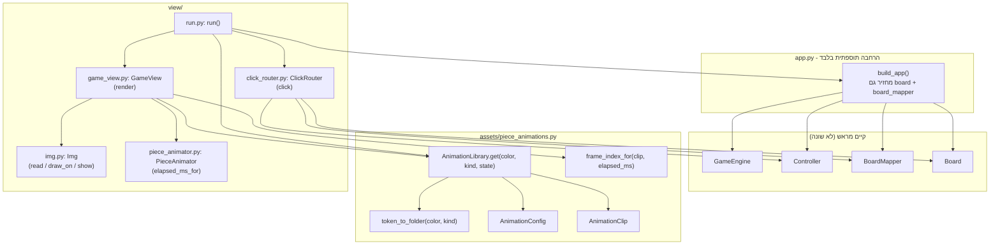
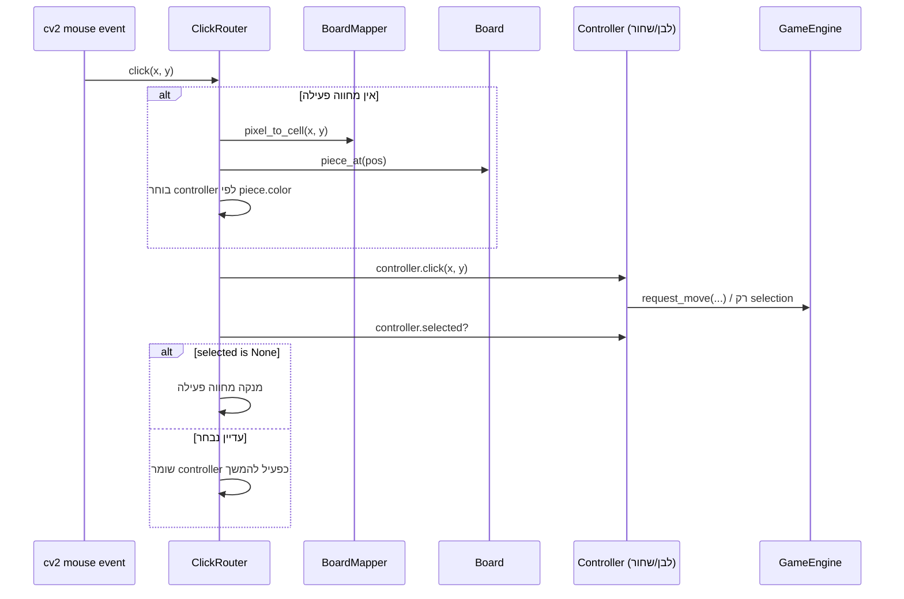

# ה-View האינטראקטיבי - מה נוסף ולמה

מסמך זה מתעד את כל הקבצים/המחלקות/הפונקציות שנוספו כדי להפוך את המשחק
ממריץ טקסטואלי (`app.run(input_lines)` שקורא פקודות מ-stdin) למשחק גרפי
אינטראקטיבי אמיתי (`python -m view.run`) - **בלי לשנות שום לוגיקת משחק
קיימת** (Controller/GameEngine/RealTimeArbiter/RuleEngine נשארו כפי שהיו).

## תרשים רכיבים - מי תלוי במי



## שלבי הבנייה, לפי סדר

### שלב 0 - תשתית מוקדמת (כבר הייתה קיימת לפני ה-view)
זה לא נוסף עכשיו, אבל ה-view **תלוי בזה לגמרי**:

| קובץ | מה יש שם |
|---|---|
| `model/piece.py` | `AnimationState` (Enum: `IDLE/MOVE/JUMP/LONG_REST/SHORT_REST`) |
| `model/game_state.py` | `PieceSnapshot` עם `render_row`/`render_col` (float, למיקום מדויק על המסך) ו-`animation_state` |
| `engine/game_engine.py` | `GameEngine.snapshot()` → `_piece_snapshot()` / `_interpolated_position()` - מחשבים את ה-render position וה-animation_state לכל כלי בכל רגע |

### שלב 1 - קריאת ה-assets (`assets/piece_animations.py`)
תפקיד: להמיר בין הזהות הפנימית של כלי (`PieceColor`+`PieceKind`) לבין
תיקיית ה-assets בדיסק (`pieces2/<TOKEN>/states/<state>/`), בלי שום תלות
ב-cv2 - קובץ טהור שניתן לבדוק ביחידה.

| פונקציה/מחלקה | תפקיד |
|---|---|
| `token_to_folder(color, kind) -> str` | `(WHITE, QUEEN) -> "QW"` - מיפוי מאומת מול כל 12 התיקיות בפועל |
| `AnimationConfig` (dataclass) + `.from_json()` | `speed_m_per_sec` / `next_state_when_finished` / `frames_per_sec` / `is_loop`, נטען מ-`config.json` |
| `AnimationClip` (dataclass) | `config` + `sprite_paths: list[str]` (נתיבים בלבד, לא טעינת פיקסלים) |
| `AnimationLibrary.__init__` → `_scan()` → `_load_clip()` | סורק פעם אחת את כל 12×5 השילובים ובונה dict |
| `AnimationLibrary.get(color, kind, state)` | Lookup בודד |
| `frame_index_for(clip, elapsed_ms) -> int` | לפי `frames_per_sec`; `is_loop=True` → `frame % n`, אחרת → `min(frame, n-1)` |

תוספת קטנה ב-`constants.py`: `PIECES_DIR = "pieces2"`, `BOARD_IMAGE_PATH = "board.png"`.

### שלב 2 - טיימינג אנימציה טהור (`view/piece_animator.py`)
בעיה: `PieceSnapshot.animation_state` אומר **מה** המצב הנוכחי, אבל לא
**כמה זמן** הכלי כבר בו - וזה נדרש כדי לדעת איזה frame להציג.
`GameEngine` לא עוקב אחרי זה בכוונה (סוכם בשיחה קודמת) - זו אחריות ה-view.

| פונקציה | תפקיד |
|---|---|
| `PieceAnimator.elapsed_ms_for(piece_snapshot, clock_ms)` | משווה למצב הקודם שנשמר; אם השתנה → מתחיל למנות מ-0 |
| `PieceAnimator.forget(piece_id)` | ניקוי כשכלי נעלם (נאכל) |

### שלב 3 - ציור פיקסלים (`view/img.py`)
עיבוד ישיר של `img.py`/`example.py` שסיפקת (אותה לוגיקה בדיוק, רק ניקוי
תווים שנפגעו בהעתקה - `100Ã100`→`100x100` וכו').

| מתודה | תפקיד |
|---|---|
| `Img.read(path, size, keep_aspect)` | טעינת PNG (כולל אלפא) + resize |
| `Img.draw_on(other_img, x, y)` | ציור עם alpha blending אם יש ערוץ אלפא (הספרייטים ב-`pieces2` כן שקופים באמת - בדקנו) |
| `Img.show()` | חלון בודד לבדיקה ידנית |

### שלב 4 - הרכבת פריים שלם (`view/game_view.py`)
| מתודה | תפקיד |
|---|---|
| `GameView.__init__` | טוען את `board.png` **פעם אחת** (נמתח ל-`8*CELL_SIZE`), מכין `_sprite_cache` ריק |
| `GameView.render(snapshot, clock_ms)` | מעתיק את לוח הבסיס (`copy()`, לא טוען מהדיסק כל פריים), מצייר כל כלי |
| `GameView._draw_piece(canvas, piece, clock_ms)` | `library.get(...)` → `animator.elapsed_ms_for(...)` → `frame_index_for(...)` → `sprite.draw_on(canvas, x, y)` לפי `render_col*cell_size, render_row*cell_size` |
| `GameView._sprite(path)` | קאש - כל תמונת sprite נטענת מהדיסק פעם אחת בלבד |

### שלב 5 - ניתוב קליקים (`view/click_router.py`)
זו הנקודה שדנו עליה בהרחבה: קליק בודד מהעכבר לא נושא צבע - `Controller`
עצמו לא מכיר צבע בכלל (ובכוונה לא הוספנו לו). הפתרון: **הצבע של הכלי
בקליק ה-ראשון** של כל מחווה (select→act) קובע לאיזה מ-2 ה-`Controller`
היא שייכת; כל קליק נוסף באותה מחווה (גם אם על תא ריק/כלי אויב) הולך
לאותו controller, עד שהבחירה שלו מתאפסת.

| מתודה | תפקיד |
|---|---|
| `ClickRouter.click(x, y)` | אם יש מחווה פעילה → מנתב אליה. אחרת → `_controller_for` |
| `ClickRouter._controller_for(x, y)` | `board_mapper.pixel_to_cell` + `board.piece_at` + `piece.color` → controller מתאים |

**מגבלה מתועדת (עלתה מהטסטים):** עם עכבר יחיד, שני הצדדים **לא** יכולים
להחזיק בחירה פתוחה בו-זמנית - מי שקליק אחד קודם "תופס" את העכבר עד
שהמחווה שלו נגמרת (בדיוק כמו קליק-רגיל-לכלי-אויב = תפיסה, לא "העברת
תור"). ראה `tests/test_click_router.py::test_black_cannot_start_its_own_gesture_while_white_is_mid_gesture`.

### שלב 6 - חיבור ל-`app.py` (שינוי תוספתי בלבד)
`AppComponents`/`build_app()` הוסיפו שני שדות (`board`, `board_mapper`)
לצד השדות הקיימים (`engine`, `controller`) - כדי ש-`view/run.py` יוכל
לבנות `Controller` שני בלי לשכפל את לוגיקת החיווט. שום קוד קיים
(`app.run`, `ScriptRunner`, `tests/test_app.py`) לא נגע בו.

### שלב 7 - נקודת הכניסה (`view/run.py`)
| שם | תפקיד |
|---|---|
| `STANDARD_START_BOARD` | עמדת פתיחה סטנדרטית 8x8, בפורמט הטקסט הקיים של `board_io.build_board` |
| `run(board_text=None)` | בונה הכל דרך `app.build_app`, פותח חלון cv2, לולאת משחק |
| `_on_mouse(router, event, x, y)` | callback ל-`cv2.setMouseCallback`, מפעיל `router.click` בלבד (jump נדחה בכוונה) |

## מה קורה בכל פריים (render loop)

```mermaid
sequenceDiagram
    participant Loop as run() loop
    participant GE as GameEngine
    participant GV as GameView
    participant PA as PieceAnimator
    participant AL as AnimationLibrary
    participant IMG as Img (cv2)

    Loop->>GE: engine.wait(dt_ms)
    Loop->>GE: engine.snapshot()
    GE-->>Loop: GameSnapshot (render_row/col, animation_state לכל כלי)
    Loop->>GV: view.render(snapshot, engine.clock)
    GV->>IMG: canvas = board_image.copy()
    loop לכל כלי ב-snapshot
        GV->>AL: library.get(color, kind, animation_state)
        AL-->>GV: AnimationClip
        GV->>PA: elapsed_ms_for(piece, clock)
        PA-->>GV: elapsed_ms
        GV->>GV: frame_index_for(clip, elapsed_ms)
        GV->>IMG: sprite.draw_on(canvas, x, y)
    end
    GV-->>Loop: canvas
    Loop->>IMG: cv2.imshow(canvas.img)
```

## מה קורה בקליק עכבר



## קבצים חדשים/שונו - סיכום

| קובץ | סטטוס |
|---|---|
| `assets/__init__.py`, `assets/piece_animations.py` | חדש |
| `view/img.py`, `view/piece_animator.py`, `view/game_view.py`, `view/click_router.py`, `view/run.py` | חדש |
| `app.py` | שונה (תוספתי בלבד - 2 שדות) |
| `constants.py` | שונה (תוספתי בלבד - 2 קבועים) |
| `requirements.txt` | חדש (`opencv-python`) |
| `tests/test_piece_animations.py`, `tests/test_piece_animator.py`, `tests/test_click_router.py` | חדש |

## איך מריצים

```
python -m view.run
```

(חובה כ-module מהשורש - לא `python view/run.py` ישירות, כי אז
`sys.path` לא כולל את שורש הפרויקט ו-`import app`/`import constants`
ייכשלו.)
